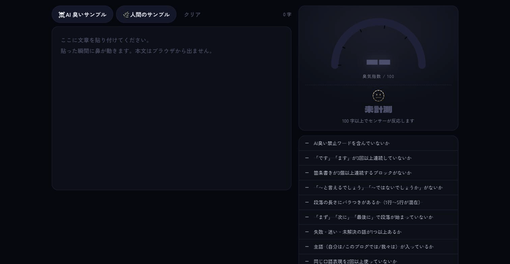
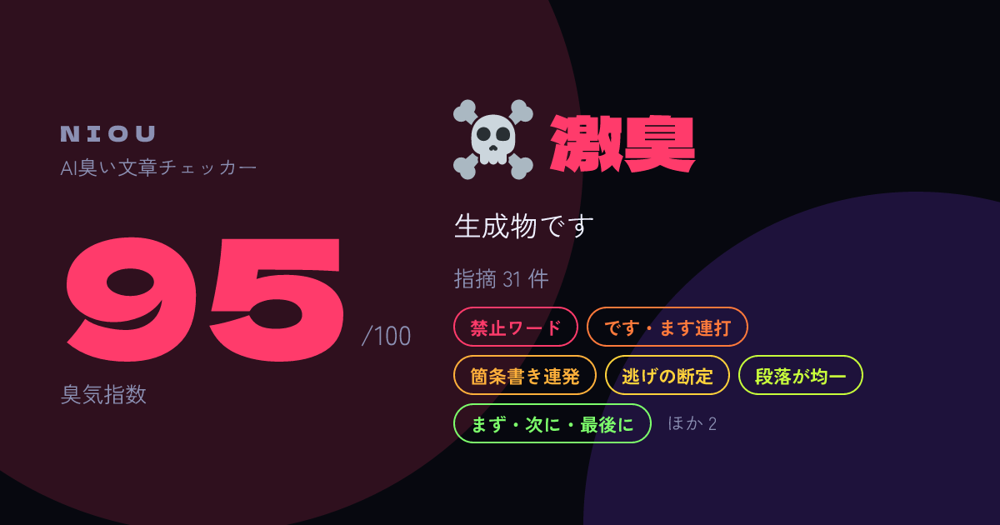

<h1 align="center">👃 NIOU</h1>

<p align="center"><strong>その文章、AI臭くない？</strong><br />
日本語の文章を貼るだけで「AI が書いた感」の出る箇所を炙り出し、臭気指数を出す。<br />
Cloudflare Workers の上で、Hono + React で動く。</p>

<p align="center">
  <a href="https://niou.karamage.workers.dev"><strong>👉 https://niou.karamage.workers.dev で試す</strong></a>
</p>

<p align="center">
  <a href="https://niou.karamage.workers.dev"></a>
  <a href="LICENSE"></a>
  
  
  
  
  
  
</p>

<p align="center">
  
</p>

<p align="center">
  
</p>

<p align="center">
  <a href="#使い方">使い方</a> ·
  <a href="#何を嗅いでいるのか">判定ルール</a> ·
  <a href="#cli--ci-で使う">CLI</a> ·
  <a href="#デプロイ">デプロイ</a>
</p>

---

## 何ができるか

- 貼った瞬間に解析。13 のルールで指摘箇所がエディタ上でルール別に色付けされ、クリックすると該当箇所に飛ぶ
- 臭気指数（0〜100）と 5 段階の臭気レベル（無臭 🌿 → 激臭 ☠️）。指数が上がるほど画面の煙が濃くなる
- 本文はブラウザから出ない。静的解析はすべてクライアント側で完結する
- 結果カード（OG 画像）を Worker 上で生成。X に貼ると 1200×630 のカードが出る。共有 URL にはスコアと指摘ルールだけが入り、本文は含まれない
- 同じエンジンを CLI でも使える。CI で臭気指数が閾値を超えたら落とせる

## 何を嗅いでいるのか

静的解析のルールは 13 個。R0〜R9 の元ネタは「AI 臭い文章」を見分けるための実務チェックリスト。R10 は [natural-japanese](https://github.com/coji/natural-japanese) の lint にある統計系検出器（burstiness、文長の自己相関、段落構造の均質さ）を、形態素解析なしで動くように文字数ベースで移植したもの。

| ID | チェック | 判定 |
|---|---|---|
| R0 | AI 臭い禁止ワードを含んでいないか | 約 100 パターンの辞書（「いかがでしたか」「〜について解説します」「可能性を秘めて」「3つのポイント」「---」「✅」「正直言うと」…） |
| R1 | 「です」「ます」が 3 回以上連続していないか | 同じ文末が 3 文続いたら |
| R2 | 箇条書きが 3 個以上連続するブロックがないか | `-` `・` `1.` `①` などが 3 行以上 |
| R3 | 「〜と言えるでしょう」「〜ではないでしょうか」がないか | 表記ゆれ込みの正規表現 |
| R4 | 段落の長さにバラつきがあるか | 推定行数の変動係数と、1 行段落・3 行以上段落の有無 |
| R5 | 「まず」「次に」「最後に」で段落が始まっていないか | 段落先頭の順序接続詞 |
| R6 | 失敗・迷い・未解決の話が 1 つ以上あるか | 失敗語彙（ハマった、詰まった、未解決…）の有無 |
| R7 | 主語（自分は / このブログでは / 我々は）が入っているか | 一人称主語の有無 |
| R8 | 同じ口語表現を 2 回以上使っていないか | 口語辞書で 2 回目以降を指摘 |
| R9 | 見出し直後が「説明」ではなく「結論」か「具体例」か | 見出し直後の 1 文目が「〜とは」「〜について解説します」型か |
| R10 | 文の長短にメリハリがあるか | 文長の burstiness（閾値 −0.24）、隣接文長の自己相関、段落あたり文数の均質さ、同じ型の文末の連続、同じ文頭の反復 |
| R11 | AI が好む構文を使っていないか | 「Aではなく、Bである」「単なるAではなく、Bなのです」「Aであり、Bであり、Cである」「Aすることで、Bできる」「ここで大事なのは〜」「一方で〜。しかし〜。だから〜」 |
| R12 | 変な比喩に頼っていないか | 地図・仕様書・設計書・羅針盤・土台・柱・栄養・筋トレ・DNA・車の両輪・潤滑油・エンジン・スパイス・レシピ。「〜の土台となる」のように比喩として使われた形だけ拾う |

R4 / R6 / R7 / R10 は文書全体を見るルールなので、400 字未満では評価しない。100 字未満は指数を出さない。

ルールはそれぞれ 1 ファイル（`src/core/rules/r*.ts`）で、辞書は `src/core/dict/` にある。語を足したいときはそこを触るだけでいい。

## 使い方

ブラウザで https://niou.karamage.workers.dev を開き、文章を貼るだけ。インストールも登録も要らない。

手元で動かすなら:

```sh
bun install
bun run dev        # http://localhost:5173
```

```sh
bun test           # ルールごとのユニットテストと Worker のスモークテスト
bun run typecheck  # TypeScript 7（ネイティブ tsc）
bun run lint       # oxlint + Biome
bun run build
```

## CLI / CI で使う

```sh
bun run cli draft.md
cat draft.md | bun run cli
bun run cli posts/*.md --threshold 55   # 臭気指数 55 以上があれば exit 1
bun run cli draft.md --json
```

```
👃 NIOU draft.md
  臭気指数 100 / 100  ☠️ 激臭  生成物です

  ✘ AI臭い禁止ワードを含んでいないか ×20
  ✘ 「です」「ます」が3回以上連続していないか ×2
  ✘ 箇条書きが3個以上連続するブロックがないか ×1
  ...
```

## API

`POST /api/analyze` に `{ "text": "..." }` を送ると、ブラウザと同じレポートが JSON で返る。

## デプロイ

```sh
bunx wrangler login
bun run deploy
```

バインディングは静的アセットだけ。KV も D1 も AI も使わないので、Workers の無料プランでそのまま動く。

## 構成

```
src/
  core/      解析エンジン。DOM も Cloudflare API も触らない純 TypeScript
  worker/    Hono。/api/*、共有ページ /r/:code、OG 画像 /og/:code.png
  client/    React 19。エディタのハイライト重ね描き、臭気計、煙の Canvas
  cli.ts     同じエンジンを CLI で
```

- Vite 8 + `@cloudflare/vite-plugin`。クライアントは `dist/client`、Worker は `dist/niou` に出る
- OG 画像は `workers-og`（Satori + resvg）。日本語フォントは Google Fonts のサブセットを取得し、Cache API に載せる
- 型は TypeScript 7、Lint は oxlint と Biome、テストは `bun test`

## 注意

判定はヒューリスティックです。人間が書いた名文も普通に激臭判定されます。

## License

MIT
